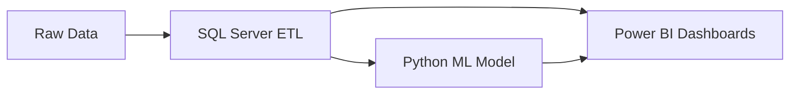

# Customer-Churn-Analysis-End-to-End-Analytics-ML-Project
<br/>

## :clipboard: Executive Summary
### Overview
We’ve all heard that keeping a customer is much cheaper than finding a new one, but for a business to actually do that, they need to know exactly who is leaving and why.

I built this project to bridge that gap. It’s not just a set of charts; it’s a full data pipeline designed to help a retention team move from guessing to acting. By connecting SQL Server, Python, and Power BI, I transformed a messy dataset of customer behaviors into a clear, predictive strategy.

What makes this project different is the focus on "clean" architecture. I treated the data the way a real enterprise would—implementing strict validation in SQL, building a robust Random Forest model in Python, and finally, creating a Power BI dashboard that doesn't just show numbers, but tells a story that a manager can use to save a customer account today.



### Key Insights & Business Impact
* Overall Churn Rate: ~27%
* High-Risk Segments:
  * Age > 50 → 31% churn
  * Month-to-Month contracts → 46.5% churn
  * Short tenure customers → highest volatility
* Service Weakness: Fiber Optic users churn at 41.1%
* Competitive Pressure: 
     * Better devices and better offers dominate competitor churn reasons
<br/>

## :hammer_and_wrench: Tech Stack & Skills 

### Skills Demonstrated
* <ins>SQL-based ETL & data validation</ins> – Ensured data accuracy through thorough quality checks and consistent schema validation throughout the pipeline
* <ins>KPI standardization & metric governance</ins> – Established clear churn definitions and business rules to keep metrics consistent and reliable across teams
* <ins>Power BI data modeling & dashboard design</ins> – Built intuitive, executive-ready dashboards that let non-technical stakeholders explore data on their own
* <ins>Applied machine learning for business prediction</ins> – Developed predictive models to flag at-risk customers early, enabling proactive retention efforts
* <ins>Translating analytics into actionable insights</ins> – Turned complex data findings into practical retention strategies that sales, product, and operations teams could act on immediately

### Technology Stack

#### Data & ETL
* SQL Server (Staging tables, Production tables, Views)
* CSV ingestion via Import Wizard

#### Analytics & Visualization
* Power BI
  * DAX measures
  * Data modeling
  * Interactive dashboards
  * Drill-throughs & tooltips
#### Machine Learning
* Python
  * Pandas, NumPy
  * Scikit-learn
  * Random Forest Classification
<br/>

## :dart: Project Context

### Business Problem

Customer churn directly impacts revenue, growth, and long-term profitability—especially in highly competitive industries like telecommunications. Organizations often struggle with:
* Fragmented churn metrics across reports
* Limited visibility into churn drivers
* Reactive retention strategies instead of proactive interventions
  
This project addresses those gaps by building a ****repeatable churn monitoring and prediction pipeline****.

### Project Objectives
* Build an end-to-end ETL pipeline for customer churn analysis
* Standardize churn KPIs and definitions across reporting layers
* Analyze churn drivers across demographic, geographic, service, and account dimensions
* Predict future churners using machine learning
* Enable proactive, operationally actionable retention insights

### Architecture
 ```mermaid
 graph TD
    A[CSV Source] --> B[SQL Server: stg_Churn]
    B --> C{Validation and Cleaning}
    C --> D[SQL Server: prod_Churn]
    D --> E[SQL Views: Reporting & ML]
    E --> F[Power BI Dashboards]
    E --> G[Python ML Model: Random Forest]
    G --> H[Predicted Churn Outputs]
    H --> I[Power BI: Churn Prediction Dashboard]
 ```
<br/>

## :gear: Technical Execution
### STEP 1 – SQL Server ETL

#### Key ETL Design Decisions
* Separate staging and production tables
* Enforce primary key on Customer_ID
* Preserve data integrity while handling missing values
* Standardize categorical defaults ("None", "No", "Others")

#### Data Validation
* Distinct value profiling
* Null analysis across all 32 attributes
* Revenue consistency checks
* Churn totals validated against aggregates

#### Output Tables & Views
```
* prod_Churn – cleansed analytical dataset
* vw_ChurnData – customers who stayed or churned
* vw_JoinData – new joiners for churn prediction
```
### STEP 2 – Power BI Data Transformation
#### Derived Columns
* Churn Status (binary flag)
* Monthly Charge Ranges
* Age Groups with custom sorting
* Tenure Groups with lifecycle-based buckets
#### Data Modeling
* Reference tables for Age Groups & Tenure Groups
* Unpivoted service usage table for flexible service analysis

### STEP 3 – KPIs & Measures (DAX)
* Total Customers
* New Joiners
* Total Churn
* Churn Rate
All KPIs are validated against SQL backend calculations to ensure consistency.

### STEP 4 – Power BI Dashboards
#### Executive Summary Page
* Total Customers
* New Joiners
* Total Churn
* Churn Rate (%)
#### Analytical Breakdowns
* Demographic: Gender, Age Group
* Account: Payment Method, Contract Type, Tenure
* Geographic: State-level churn
* Services: Internet Type, Service Combinations
* Churn Reasons: Tooltip-driven breakdowns
Dashboards are fully interactive with slicers, drill-downs, and tooltips to support self-service analysis.

### STEP 5 – Churn Prediction (Machine Learning)
#### Model Choice
* ****Random Forest Classifier****
  * Handles nonlinear relationships
  * Robust to noise
  * Reduces overfitting via ensemble learning
#### Data Preparation
* Label encoding for categorical variables
* Train-test split (80/20)
* Removal of non-predictive identifiers
#### Model Evaluation
* Confusion Matrix
* Classification Report
* Feature Importance Analysis
Key drivers included contract type, tenure, billing method, service usage, and monthly charges.

### STEP 6 – Predicted Churn Reporting
#### Outputs
* Identified 378 high-risk customers
* Predictions integrated into Power BI

#### Prediction Dashboard
* Customer-level churn risk table
* Demographic & account-level churn counts
* Revenue, refunds, and referral context for prioritization
This enables operations and retention teams to focus on high-value, high-risk customers.
<br/>

## :book: Closing & Documentation

### Dataset
* ~6,400 customer records<br/>
* 32 structured attributes<br/>
Covers demographics, services, contracts, billing, tenure, revenue, and churn reasons

### Target Audience
While the dataset is telecom-focused, the methodology is industry-agnostic and applicable to:
* Telecom & utilities
* Subscription-based services
* Retail & e-commerce
* Financial services
* SaaS platforms
  
Any organization with recurring customers and transactional data can adapt this approach.

### Operational Value
* Enables proactive retention instead of reactive churn analysis
* Prioritizes customers by churn risk and revenue impact
* Reduces manual reporting effort through automated SQL + Power BI pipelines
* Creates a scalable foundation for CRM or marketing campaign integration


 


End-to-end customer churn analytics and prediction solution using SQL Server, Power BI, and Random Forest modelling—built to replicate enterprise-grade ETL, KPI standardisation, and retention decision workflows.
